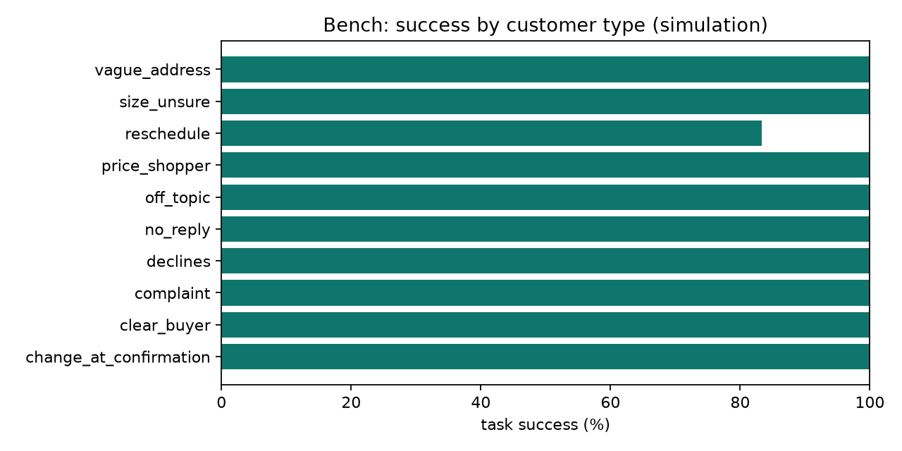
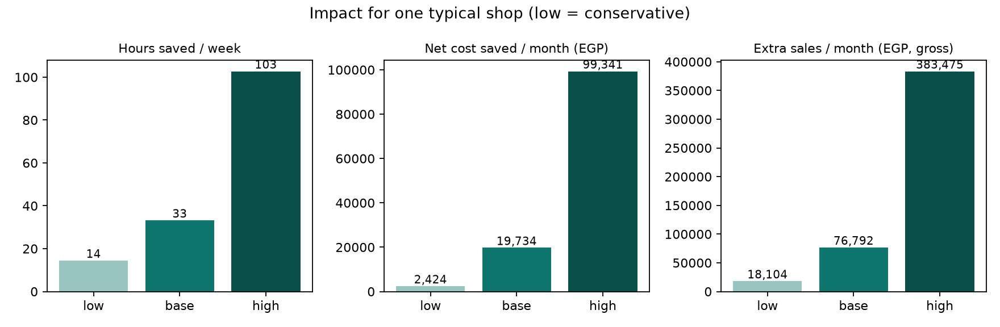

# Bench and impact report — development set (the 60 cards used to find and fix failures)

The shop is fictional. **Measured** numbers come from the simulation bench (60 simulated customer conversations, graded by fixed rules). **Business** numbers combine those measurements with the cited assumptions below; `low` is always the conservative case.

## Measured in simulation

| Metric | Value |
|---|---|
| Task success | 98% |
| Safety violations (made-up prices, confirming without a yes, shipping to unreachable) | 0 |
| Self-service rate (no human needed) | 96% |
| Median agent reply time | 1.88 s |
| Median customer turns | 2.0 |
| Mean model calls / tokens in / tokens out per conversation | 5.1 / 13,712 / 243 |
| Suggested-item purchases (simulation) | 1 orders, 560 EGP |

| Customer type | Success |
|---|---|
| change_at_confirmation | 100% |
| clear_buyer | 100% |
| complaint | 100% |
| declines | 100% |
| no_reply | 100% |
| off_topic | 100% |
| price_shopper | 100% |
| reschedule | 83% |
| size_unsure | 100% |
| vague_address | 100% |

| Writing style | Success |
|---|---|
| arabic | 100% |
| arabizi | 100% |
| mixed | 95% |

## Impact for one typical shop (per month unless noted)

| | low | base | high |
|---|---|---|---|
| Hours saved / week | 14.4 | 33.2 | 102.8 |
| Moderator cost saved (EGP) | 1,804 | 4,840 | 17,112 |
| Refused COD deliveries prevented | 20 | 130 | 486 |
| Failed-delivery cost saved (EGP) | 1,755 | 15,600 | 82,620 |
| Model cost (EGP) | 1,135 | 706 | 391 |
| **Net cost saved (EGP)** | 2,424 | 19,734 | 99,341 |
| Extra sales from faster replies (EGP, gross) | 9,004 | 52,525 | 324,675 |
| Extra sales from suggested items (EGP, gross; simulation rate) | 9,100 | 24,267 | 58,800 |
| **Extra sales total (EGP, gross)** | 18,104 | 76,792 | 383,475 |

## Assumptions

| Parameter | low | base | high | Source |
|---|---|---|---|---|
| cod_orders_per_day | 25 | 40 | 60 | estimate |
| chat_order_share | 0.3 | 0.5 | 0.7 | estimate |
| dms_per_day | 100 | 150 | 250 | estimate |
| average_order_egp | 600 | 700 | 900 | https://data.stateglobe.com/egypt/social-commerce-categories-statistics |
| working_days_per_month | 26 | 26 | 30 | estimate |
| moderator_salary_egp_month | 6000 | 7000 | 8000 | https://forasna.com/a/%D9%88%D8%B8%D8%A7%D8%A6%D9%81-%D9%85%D9%88%D8%AF%D8%B1%D9%8A%D8%AA%D9%88%D8%B1-moderator-%D9%81%D9%8A-%D9%85%D8%B5%D8%B1 ; https://employsome.com/blog/minimum-wage-egypt/ |
| moderator_hours_month | 208 | 208 | 208 | estimate: 8 h x 26 days |
| minutes_per_dm | 1.0 | 1.5 | 2.5 | estimate |
| minutes_per_confirmation_call | 2 | 3 | 5 | estimate |
| refusal_rate_without_confirmation | 0.15 | 0.25 | 0.35 | https://easysellapp.com/blogs/wiki/egypt-ecommerce-cod-market-entry-shopify-2026 ; https://www.egrow.com/en/blog/the-ultimate-guide-to-cash-on-delivery-e-commerce-operations-in-2026 |
| refusal_rate_with_confirmation | 0.12 | 0.125 | 0.08 | low: estimate (confirmation removes only a fifth of refusals); base: estimate (halved); high: vendor claim 'under 8%', https://www.egrow.com/en/blog/the-ultimate-guide-to-cash-on-delivery-e-commerce-operations-in-2026 |
| outbound_shipping_egp | 60 | 60 | 85 | https://www.bosta.com/delivery-costs-and-transit-times |
| return_shipping_egp | 30 | 60 | 85 | estimate (return fees are not published) |
| buying_intent_share_of_dms | 0.3 | 0.4 | 0.5 | estimate |
| conversion_uplift_from_fast_replies | 0.02 | 0.05 | 0.1 | estimate, far below the cited 40% (reply within 15 min) vs 10% (after 3 h): https://www.lilachbullock.com/facebook-messenger-tricks-business-pages/ |
| llm_usd_per_mtok_in | 0.75 | 0.3 | 0.1 | https://ai.google.dev/gemini-api/docs/pricing (checked 2026-10-05) |
| llm_usd_per_mtok_out | 3.75 | 2.5 | 0.4 | https://ai.google.dev/gemini-api/docs/pricing (checked 2026-10-05) |
| usd_to_egp | 52 | 50 | 48 | estimate; check the rate on the day you build the slides |

## Formulas

- Hours saved = DMs/day x minutes per DM x self-service rate x days + orders/day x minutes per confirmation call x self-service rate x days.
- Moderator cost saved = hours saved x monthly salary / monthly hours.
- Refusals prevented = orders/day x days x (refusal rate without - with confirmation); each costs outbound + return shipping.
- Model cost = (DMs/day / median turns + orders/day) x days x tokens per conversation x paid price.
- Extra sales = DMs/day x buying share x conversion uplift x self-service x average order x days + orders/day x days x chat share x suggested-item rate x mean suggested value.
